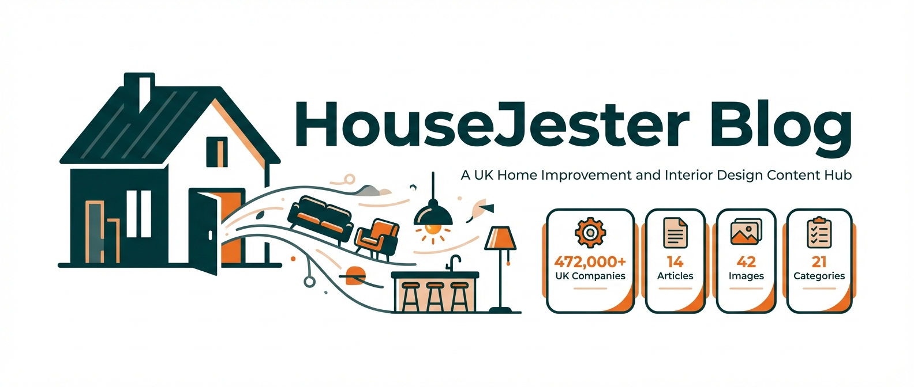
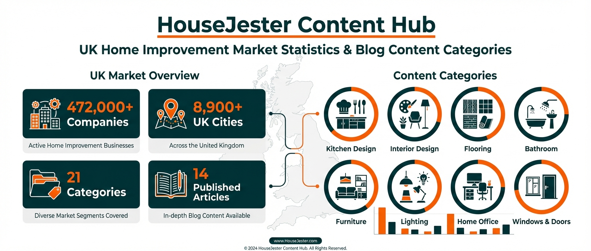
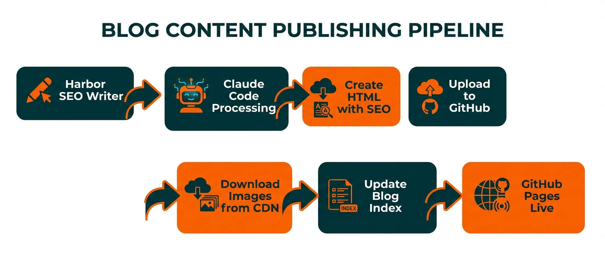
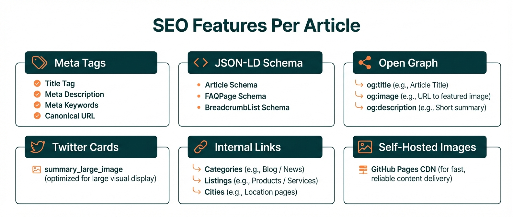
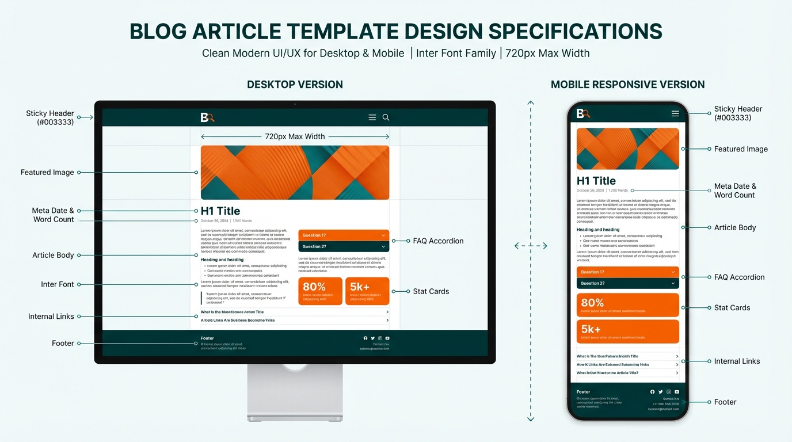

<div align="center">

# HouseJester Blog



[](https://davendra.github.io/housejester-blog/public/blog/)
[](https://housejester.com)
[](#-articles)
[](#-image-hosting)
[](#-seo-features)
[](https://housejester.com/companies)

> **The content hub for [HouseJester](https://housejester.com)** — the UK's largest furniture, interior design, and home improvement directory with **472,000+ companies** across **21 specialist categories** in **8,900+ UK cities**.

</div>

---

## 📋 Table of Contents

- [Live URLs](#-live-urls)
- [Content Hub Overview](#-content-hub-overview)
- [Publishing Pipeline](#-publishing-pipeline)
- [Articles](#-articles)
- [SEO Features](#-seo-features)
- [Template Design](#-template-design)
- [Image Hosting](#-image-hosting)
- [Repo Structure](#-repo-structure)
- [About HouseJester](#-about-housejester)

---

## 🌐 Live URLs

| Resource | URL | Description |
|----------|-----|-------------|
| **Blog Index** | [davendra.github.io/housejester-blog/public/blog/](https://davendra.github.io/housejester-blog/public/blog/) | All articles with cards |
| **Main Platform** | [housejester.com](https://housejester.com) | UK business directory |
| **Company Directory** | [housejester.com/companies](https://housejester.com/companies) | 472,000+ Companies House records |
| **Categories** | [housejester.com/categories](https://housejester.com/categories) | 21 specialist categories |
| **City Search** | [housejester.com/cities](https://housejester.com/cities) | 8,900+ UK cities |
| **RSS Feed** | [rss.xml](https://davendra.github.io/housejester-blog/public/blog/rss.xml) | Subscribe to updates |
| **API for AI Agents** | [housejester.com/.well-known/agents.json](https://housejester.com/.well-known/agents.json) | Agent discovery |
| **OpenAPI Spec** | [housejester.com/.well-known/openapi.yaml](https://housejester.com/.well-known/openapi.yaml) | Full API documentation |
| **LLMs.txt** | [housejester.com/llms.txt](https://housejester.com/llms.txt) | LLM-friendly overview |

---

## 🏠 Content Hub Overview

<div align="center">

</div>

HouseJester Blog covers the full spectrum of UK home improvement topics:

### Categories We Cover

| Category | Focus Areas | Platform Link |
|----------|-------------|---------------|
| 🍳 **Fitted Kitchens** | Layouts, cabinets, appliances, worktops | [Browse →](https://housejester.com/categories/fitted-kitchens) |
| 🎨 **Interior Design** | Trends, colour schemes, space planning | [Browse →](https://housejester.com/categories/interior-designer) |
| 🛁 **Bathrooms** | Wet rooms, fitters, spa designs | [Browse →](https://housejester.com/categories/bathrooms) |
| 🪑 **Furniture** | Bespoke, fitted, modern, traditional | [Browse →](https://housejester.com/categories/furniture) |
| 🏡 **Home Improvements** | Renovations, extensions, conversions | [Browse →](https://housejester.com/categories/home-improvements) |
| 💡 **Lighting** | Under-cabinet, pendant, smart lighting | [Browse →](https://housejester.com/categories/lighting) |
| 🪟 **Windows & Doors** | Double glazing, composite doors | [Browse →](https://housejester.com/categories/windows-and-doors) |
| 🧱 **Flooring** | Hardwood, tile, vinyl, carpet | [Browse →](https://housejester.com/categories/flooring) |

### Market Data

- **472,000+** UK companies indexed from Companies House
- **255,775** companies enriched with contact data (54% of total)
- **8,900+** UK cities and towns covered
- **21** specialist business categories
- Average UK minor kitchen renovation: **£4,900**
- Kitchen renovations offer **60–80% ROI**

---

## 🔄 Publishing Pipeline

<div align="center">

</div>

### How Articles Are Published

| Step | Tool | What Happens |
|------|------|--------------|
| **1. Write** | [Harbor SEO](https://harbor.so) | AI-assisted article writing with keyword targeting |
| **2. Process** | Claude Code | Extract images, create full HTML with SEO |
| **3. Images** | Go Bananas + R2 | Download from CDN, self-host on GitHub |
| **4. SEO** | Claude Code | JSON-LD schemas, OG tags, Twitter cards, meta |
| **5. Links** | Manual | Internal links to housejester.com pages |
| **6. Publish** | GitHub API | Upload HTML + update blog index |
| **7. Live** | GitHub Pages | Auto-deploy, globally accessible |

### Content Quality Standards

Every article meets these requirements before publishing:
- ✅ **1,000+ words** of original content
- ✅ **Self-hosted images** (no external CDN dependency)
- ✅ **3+ internal links** to housejester.com
- ✅ **FAQ section** with 5-6 questions (generates FAQPage schema)
- ✅ **Statistical callouts** with UK-specific data
- ✅ **Mobile responsive** design
- ✅ **Full SEO metadata** (meta, OG, Twitter, JSON-LD)

---

## 📝 Articles

### 🏙️ Pillar Pages
| Article | Words | Images | Link |
|---------|-------|--------|------|
| 2026 Directory of Top-Rated Interior Design & Home Specialists in London | 2,200 | 4 | [Read →](https://davendra.github.io/housejester-blog/public/blog/london-interior-design-home-specialists-directory-2026.html) |

### 🍳 Kitchen & Renovation
| Article | Words | Images | Link |
|---------|-------|--------|------|
| 10 Best Modern Fitted Kitchen Designs — Smart Layouts | 1,350 | 3 | [Read →](https://davendra.github.io/housejester-blog/public/blog/best-modern-fitted-kitchen-designs-small-homes-2026-smart-layouts.html) |
| 10 Best Modern Fitted Kitchen Designs — Compact Layouts | 1,400 | 6 | [Read →](https://davendra.github.io/housejester-blog/public/blog/modern-fitted-kitchen-designs-small-homes-2026-compact-layouts.html) |
| 10 Best Modern Fitted Kitchen Designs — Space Saving | 1,150 | 5 | [Read →](https://davendra.github.io/housejester-blog/public/blog/10-best-modern-fitted-kitchen-designs-for-small-homes-2026-guide-that-actually-s.html) |
| How to Choose the Right Kitchen Remodeling Contractor | 1,400 | 2 | [Read →](https://davendra.github.io/housejester-blog/public/blog/how-to-choose-the-right-kitchen-remodeling-contractor-near-you-in-2026.html) |
| 10 Budget-Friendly Kitchen Cabinet Upgrades (Original) | 1,500 | 1 | [Read →](https://davendra.github.io/housejester-blog/public/blog/budget-friendly-kitchen-cabinet-upgrades-uk-2026.html) |
| 10 Budget-Friendly Kitchen Cabinet Upgrades (Cost Focus) | 1,500 | 1 | [Read →](https://davendra.github.io/housejester-blog/public/blog/budget-kitchen-cabinet-upgrades-uk-homeowners-2026.html) |
| Budget-Friendly Kitchen Cabinet Ideas (ROI Focus) | 1,600 | 2 | [Read →](https://davendra.github.io/housejester-blog/public/blog/budget-friendly-kitchen-cabinet-ideas-uk-2026.html) |

### 🏡 Home & Interior Design
| Article | Words | Images | Link |
|---------|-------|--------|------|
| The Broken Floor Plan Transition (Original) | 1,600 | 1 | [Read →](https://davendra.github.io/housejester-blog/public/blog/broken-floor-plan-transition-2026.html) |
| The Broken Floor Plan Transition (Open Concept) | 1,800 | 1 | [Read →](https://davendra.github.io/housejester-blog/public/blog/broken-floor-plan-transition-open-concept-2026.html) |
| Home Office Furniture & Ergonomics: 10 Smart Upgrades | 1,500 | 6 | [Read →](https://davendra.github.io/housejester-blog/public/blog/home-office-furniture-ergonomics-10-smart-upgrades-2026.html) |
| Industrial Luxe Furniture Trends 2026 | 1,570 | 0 | [Read →](https://davendra.github.io/housejester-blog/public/blog/industrial-luxe-furniture-trends-2026-the-best-warehousestyle-living-ideas-for-m.html) |

### 📍 Regional Guides
| Article | Words | Images | Link |
|---------|-------|--------|------|
| Birmingham & West Midlands 2026 Renovation Guide | 2,100 | 1 | [Read →](https://davendra.github.io/housejester-blog/public/blog/birmingham-west-midlands-2026-renovation-guide.html) |
| Manchester Home Improvement Hub 2026 | 1,850 | 1 | [Read →](https://davendra.github.io/housejester-blog/public/blog/manchester-home-improvement-hub-2026.html) |

**Total: 14 articles · ~22,000+ words · 34+ images**

---

## 🔍 SEO Features

<div align="center">

</div>

### Schema Markup Per Article

| Schema Type | Purpose | Data Included |
|-------------|---------|---------------|
| **Article** | Search result rich snippets | headline, author, publisher, datePublished, image, keywords |
| **FAQPage** | FAQ rich results in Google | 5-6 Q&A pairs from Key Takeaways |
| **BreadcrumbList** | Navigation breadcrumbs | Housejester → Blog → Article |

### Meta Tags Checklist

```
✅ <title> — keyword-optimised, under 60 chars
✅ <meta description> — compelling, under 160 chars
✅ <meta keywords> — target + long-tail keywords
✅ <link canonical> — absolute URL
✅ <meta og:type> — "article"
✅ <meta og:title> — branded for social sharing
✅ <meta og:description> — social-optimised excerpt
✅ <meta og:image> — self-hosted featured image
✅ <meta twitter:card> — "summary_large_image"
✅ <meta twitter:image> — same featured image
```

### Internal Linking Strategy

Every article links back to housejester.com to build topical authority:

| Link Target | Purpose | Example |
|-------------|---------|---------|
| `/categories/fitted-kitchens` | Category authority | Kitchen articles |
| `/categories/interior-designer` | Category authority | Design articles |
| `/categories/flooring` | Cross-category | Floor plan articles |
| `/listings/[company-slug]` | Business verification | Company mentions |
| `/companies` | Directory discovery | All articles |
| `/cities/[city]` | Local SEO | Regional guides |
| `/search` | User engagement | All articles |
| `/submit` | Conversion | CTAs |

---

## 🎨 Template Design

<div align="center">

</div>

### Design System

| Element | Specification |
|---------|--------------|
| **Font** | Inter (Google Fonts) — 400, 500, 600, 700 |
| **Header** | `#003333` dark teal, sticky, white text |
| **Primary** | `#003333` (dark teal) |
| **Accent** | `#F95F00` (bright orange) |
| **Max Width** | 720px content area |
| **Cards** | 12px border-radius, hover shadow |
| **Stat Cards** | Gradient `#e6f0f0` → `#f0f7f7`, 4px left border |
| **Tables** | Teal header, alternating rows |
| **FAQ** | Native `<details>`/`<summary>` accordion |
| **Responsive** | Mobile-first, breakpoint at 640px |
| **Images** | 100% width, 10px border-radius, lazy loading |

### Page Components

| Component | Usage |
|-----------|-------|
| **Hero Header** | Sticky nav with logo + Blog link |
| **H1 Title** | 2rem, dark text, 1.3 line-height |
| **Meta Line** | Date · word count · category |
| **Featured Image** | Full-width with border-radius |
| **Stat Cards** | "Did You Know?" callouts with data |
| **FAQ Accordion** | Expandable Q&A from Key Takeaways |
| **Cost Tables** | Teal-header comparison tables |
| **Internal Links** | Contextual links to housejester.com |
| **Footer** | © 2026 Housejester |

---

## 🖼️ Image Hosting

All **47 images** are self-hosted on GitHub Pages — zero external CDN dependency:

```
public/blog/images/
├── 📊 Infographics
│   ├── cabinet-infographic.jpg
│   ├── cabinet-v2-infographic.jpg
│   ├── cabinet-v3-infographic.jpg
│   ├── contractor-infographic.jpg
│   ├── floorplan-infographic.jpg
│   ├── floorplan2-infographic.jpg
│   ├── kitchen2-infographic.jpg
│   ├── kitchen3-infographic.jpg
│   └── office-infographic.jpg
│
├── 🍳 Kitchen Articles
│   ├── kitchen-{1-7}.jpg, kitchen-3.png
│   ├── kitchen2-colours.png, kitchen2-lighting.jpg
│   └── kitchen3-{design,colours,flooring,openplan,seating}.*
│
├── 🏡 Home & Design
│   ├── cabinet-v3-lighting.jpg
│   ├── contractor-brand.jpg
│   └── office-{1-5}.jpg
│
├── 📍 Regional
│   ├── birmingham-hub-1.jpg
│   └── manchester-hub-1.jpg
│
├── 🏙️ London Pillar
│   └── london-{1-4}.jpg
│
└── 📋 README Infographics
    ├── readme-banner.jpg
    ├── readme-pipeline.jpg
    ├── readme-seo.jpg
    ├── readme-contenthub.jpg
    └── readme-template.jpg
```

---

## 📁 Repo Structure

```
housejester-blog/
├── README.md                        # This file
└── public/
    └── blog/
        ├── index.html               # Blog listing (14 article cards)
        ├── *.html                   # 14 individual article pages
        ├── rss.xml                  # RSS feed
        └── images/                  # 47 self-hosted images
            ├── *-infographic.jpg    # Data infographics
            ├── kitchen*.jpg/png     # Kitchen article images
            ├── office-*.jpg         # Office article images
            ├── london-*.jpg         # London pillar images
            ├── *-hub-*.jpg          # Regional guide images
            └── readme-*.jpg         # README infographics
```

---

## 🏠 About HouseJester

**[HouseJester](https://housejester.com)** is the UK's comprehensive furniture, interior design, and home improvement directory.

### Platform Stats

| Metric | Value |
|--------|-------|
| **Companies Indexed** | 472,000+ (Companies House) |
| **Enriched Companies** | 255,775 (54%) with websites, phones, ratings |
| **Categories** | 21 specialist categories |
| **UK Cities** | 8,900+ covered |
| **Verified Listings** | 557+ with enriched descriptions |
| **Blog Articles** | 14 on GitHub Pages + 51+ on main platform |

### Tech Stack

| Component | Technology |
|-----------|------------|
| **Frontend** | Next.js 15 (App Router, React 19) |
| **Backend** | Convex (real-time database + serverless) |
| **Auth** | Clerk |
| **Styling** | TailwindCSS v4 + shadcn/ui |
| **Blog** | Static HTML on GitHub Pages |
| **Images** | Go Bananas AI + self-hosted |
| **Content** | Harbor SEO + Claude Code pipeline |
| **SEO** | JSON-LD, OpenAPI, agents.json, llms.txt |

### AI & API Endpoints

| Endpoint | Description |
|----------|-------------|
| `/api/ai/categories` | List all 21 categories |
| `/api/ai/categories/{slug}` | Category detail with listings |
| `/api/ai/listings/{slug}` | Full listing detail |
| `/api/ai/search?q=&city=` | Search listings |
| `/api/ai/companies?q=&city=` | Search 472K+ companies |
| `/api/ai/cities` | All UK cities with counts |
| `/api/ai/cities/{slug}` | City overview |
| `/.well-known/agents.json` | Agent discovery (5 flows) |
| `/.well-known/openapi.yaml` | OpenAPI 3.1 spec |
| `/llms.txt` | LLM overview |
| `/llms-full.txt` | Full directory dump |

---

<div align="center">

### 🔗 Quick Links

[**Live Blog**](https://davendra.github.io/housejester-blog/public/blog/) · [**housejester.com**](https://housejester.com) · [**Company Directory**](https://housejester.com/companies) · [**Categories**](https://housejester.com/categories) · [**Cities**](https://housejester.com/cities) · [**Search**](https://housejester.com/search) · [**Submit a Listing**](https://housejester.com/submit)

---

*Built with [Harbor SEO](https://harbor.so) · [Go Bananas AI](https://gobananasai.com) · [Claude Code](https://claude.ai/code) · [GitHub Pages](https://pages.github.com)*

</div>
