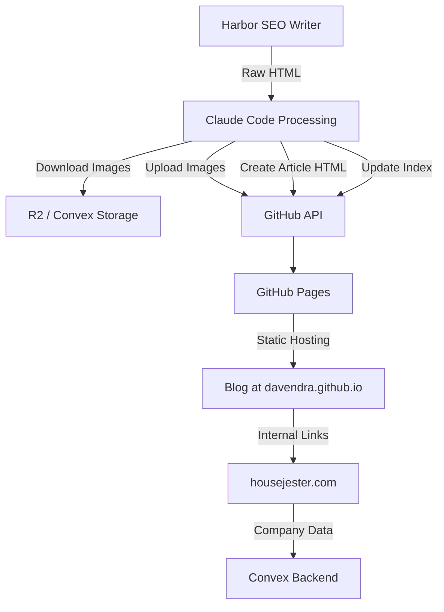
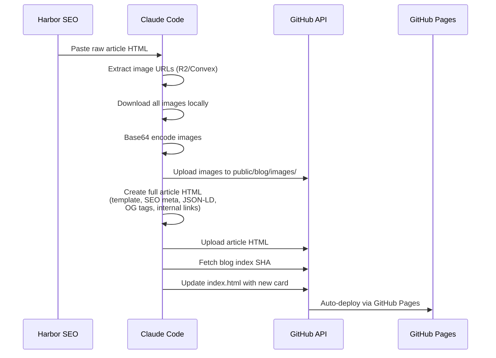
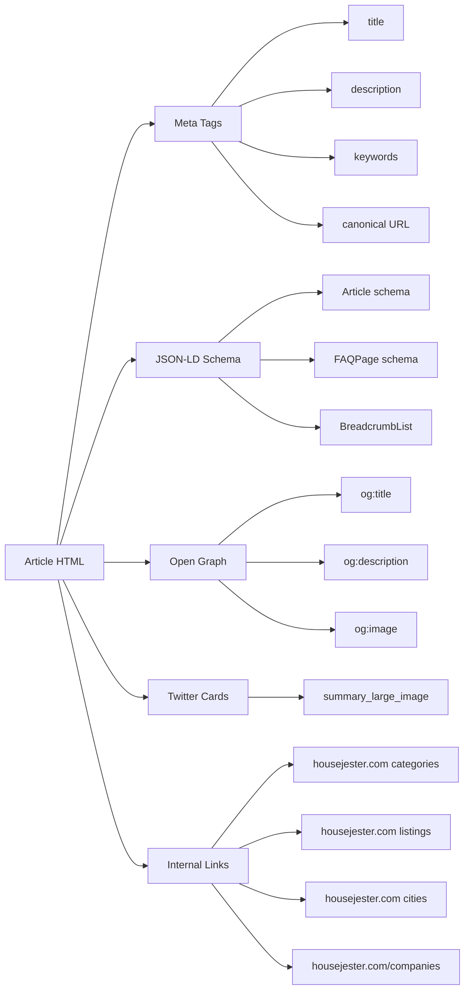

# HouseJester Blog

[](https://davendra.github.io/housejester-blog/public/blog/)
[](#articles)
[](#image-hosting)
[](#seo-features)
[](#)

> Static blog for [HouseJester](https://housejester.com) — the UK's furniture, interior design, and home improvement directory with 472,000+ companies across 21 categories.

## Live URLs

| Resource | URL |
|----------|-----|
| **Blog Index** | [davendra.github.io/housejester-blog/public/blog/](https://davendra.github.io/housejester-blog/public/blog/) |
| **Main Site** | [housejester.com](https://housejester.com) |
| **Company Directory** | [housejester.com/companies](https://housejester.com/companies) |
| **RSS Feed** | [rss.xml](https://davendra.github.io/housejester-blog/public/blog/rss.xml) |

## Architecture



## Article Publishing Workflow



## Articles

### Pillar Pages
| Article | Words | Date |
|---------|-------|------|
| [2026 Directory of Top-Rated Interior Design & Home Specialists in London](https://davendra.github.io/housejester-blog/public/blog/london-interior-design-home-specialists-directory-2026.html) | 2,200 | Mar 2026 |

### Kitchen & Renovation
| Article | Words | Date |
|---------|-------|------|
| [10 Best Modern Fitted Kitchen Designs — Smart Layouts](https://davendra.github.io/housejester-blog/public/blog/best-modern-fitted-kitchen-designs-small-homes-2026-smart-layouts.html) | 1,350 | Mar 2026 |
| [10 Best Modern Fitted Kitchen Designs — Compact Layouts](https://davendra.github.io/housejester-blog/public/blog/modern-fitted-kitchen-designs-small-homes-2026-compact-layouts.html) | 1,400 | Mar 2026 |
| [10 Best Modern Fitted Kitchen Designs — Space Saving Guide](https://davendra.github.io/housejester-blog/public/blog/10-best-modern-fitted-kitchen-designs-for-small-homes-2026-guide-that-actually-s.html) | 1,150 | Mar 2026 |
| [How to Choose the Right Kitchen Remodeling Contractor](https://davendra.github.io/housejester-blog/public/blog/how-to-choose-the-right-kitchen-remodeling-contractor-near-you-in-2026.html) | 1,400 | Mar 2026 |
| [10 Budget-Friendly Kitchen Cabinet Upgrades (Original)](https://davendra.github.io/housejester-blog/public/blog/budget-friendly-kitchen-cabinet-upgrades-uk-2026.html) | 1,500 | Mar 2026 |
| [10 Budget-Friendly Kitchen Cabinet Upgrades (Median Cost Focus)](https://davendra.github.io/housejester-blog/public/blog/budget-kitchen-cabinet-upgrades-uk-homeowners-2026.html) | 1,500 | Mar 2026 |
| [Budget-Friendly Kitchen Cabinet Ideas (ROI Focus)](https://davendra.github.io/housejester-blog/public/blog/budget-friendly-kitchen-cabinet-ideas-uk-2026.html) | 1,600 | Mar 2026 |

### Home & Interior Design
| Article | Words | Date |
|---------|-------|------|
| [The Broken Floor Plan Transition (Original)](https://davendra.github.io/housejester-blog/public/blog/broken-floor-plan-transition-2026.html) | 1,600 | Mar 2026 |
| [The Broken Floor Plan Transition (Open Concept Focus)](https://davendra.github.io/housejester-blog/public/blog/broken-floor-plan-transition-open-concept-2026.html) | 1,800 | Mar 2026 |
| [Home Office Furniture & Ergonomics: 10 Smart Upgrades](https://davendra.github.io/housejester-blog/public/blog/home-office-furniture-ergonomics-10-smart-upgrades-2026.html) | 1,500 | Mar 2026 |
| [Industrial Luxe Furniture Trends 2026](https://davendra.github.io/housejester-blog/public/blog/industrial-luxe-furniture-trends-2026-the-best-warehousestyle-living-ideas-for-m.html) | 1,570 | Mar 2026 |

### Regional Guides
| Article | Words | Date |
|---------|-------|------|
| [Birmingham & West Midlands 2026 Renovation Guide](https://davendra.github.io/housejester-blog/public/blog/birmingham-west-midlands-2026-renovation-guide.html) | 2,100 | Mar 2026 |
| [Manchester Home Improvement Hub 2026](https://davendra.github.io/housejester-blog/public/blog/manchester-home-improvement-hub-2026.html) | 1,850 | Mar 2026 |

## SEO Features

Every article includes:



### Schema Markup per Article
- **Article** — headline, author (Organization), publisher, datePublished, keywords
- **FAQPage** — 5-6 questions with answers from Key Takeaways table
- **BreadcrumbList** — Housejester → Blog → Article title

## Image Hosting

All images are self-hosted on GitHub to avoid dependency on external CDNs:

```
public/blog/images/
├── birmingham-hub-1.jpg
├── cabinet-infographic.jpg
├── cabinet-v2-infographic.jpg
├── cabinet-v3-infographic.jpg
├── cabinet-v3-lighting.jpg
├── contractor-brand.jpg
├── contractor-infographic.jpg
├── floorplan-infographic.jpg
├── floorplan2-infographic.jpg
├── kitchen-{1-7}.jpg, kitchen-3.png
├── kitchen2-{infographic,colours,lighting}.jpg/.png
├── kitchen3-{design,infographic,colours,flooring,openplan,seating}.jpg/.png
├── london-{1-4}.jpg
├── manchester-hub-1.jpg
├── office-{1-5}.jpg, office-infographic.jpg
└── ... (42 total)
```

## Template Design

| Element | Value |
|---------|-------|
| Font | Inter (Google Fonts) |
| Header | `#003333` (dark teal), sticky |
| Max Width | 720px |
| Card Style | 12px border-radius, hover shadow |
| Responsive | Mobile-first, breakpoint at 640px |

## Repo Structure

```
housejester-blog/
├── public/
│   └── blog/
│       ├── index.html              # Blog listing page (14 article cards)
│       ├── *.html                   # Individual article pages
│       ├── rss.xml                  # RSS feed
│       └── images/                  # Self-hosted article images (42 files)
└── README.md
```

## Content Source

Articles are written using [Harbor SEO](https://harbor.so) (AI content platform, Lite plan) and processed through Claude Code for:
- Image extraction and self-hosting
- Full HTML template with brand styling
- SEO metadata injection (JSON-LD, OG, Twitter)
- Internal linking to [housejester.com](https://housejester.com) pages
- Blog index card creation

## Related

- **Main App**: [HouseJester v2](https://github.com/davendra/housejester-v2) — Next.js 15 + Convex + Clerk
- **Platform**: [housejester.com](https://housejester.com) — 472,000+ UK companies, 21 categories, 8,900+ cities
